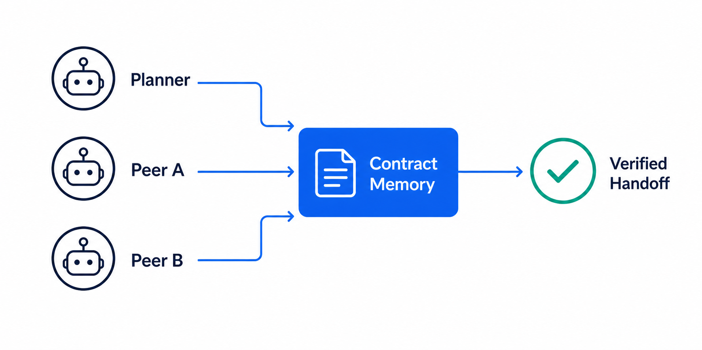
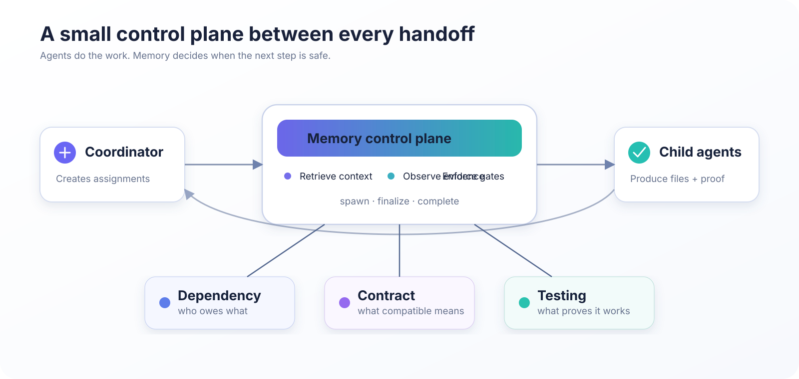
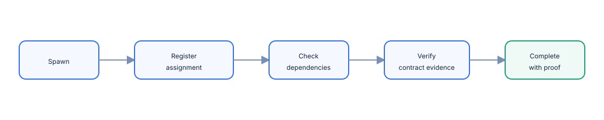

# Multi-Agent Contract Protocol

> A memory-backed protocol for reliable multi-agent collaboration.

[](./LICENSE)
[](./openclaw_plugin/package.json)
[](./openclaw_plugin/VALIDATION.md)
[](https://gitcode.com/lukchiwang/Multi-Agent_Contract_Protocol)



Multi-Agent Contract Protocol (MACP) turns agent memory into an active coordination layer. It tracks prerequisites, shared interface contracts, ownership, and executable evidence across agent handoffs. It is designed to work across CLIs; OpenClaw is the first adapter.

## Why MACP?

Ordinary prompt memory can recall facts, but it does not enforce that:

- a producer actually wrote its promised artifact;
- a consumer waits for its prerequisite;
- peers agree on a shared interface;
- verification still matches the current artifact version;
- the coordinator has objective evidence before declaring success.

MACP makes those obligations explicit and enforceable.

## Architecture



The protocol has three independent memory mechanisms:

| Mechanism | Purpose |
|---|---|
| Dependency memory | Private prerequisites, ownership, artifact readiness, and recovery |
| Co-domain contracts | Shared interface semantics, invariants, and boundary evidence |
| Testing practice | Reusable commands, evidence patterns, and learned verification procedures |

## Enforced handoff



The control plane observes the runtime, injects scoped memory, gates unresolved handoffs, invalidates stale evidence, and blocks premature completion.

## Quick start

```bash
cd openclaw_plugin
npm install
npm test
npm run build
```

See the [plugin README](./openclaw_plugin/README.md) for configuration and OpenClaw integration.

## Examples and validation

- [Sequential planner → implementer → reviewer workflow](./openclaw_plugin/examples/sequential-workflow.md)
- [Cooperative peer → integration workflow](./openclaw_plugin/examples/cooperative-workflow.md)
- [Memory toggle configurations](./openclaw_plugin/examples/configurations.json)
- [Validation results and reproduction commands](./openclaw_plugin/VALIDATION.md)
- [Release roadmap](./openclaw_plugin/ROADMAP.md)

## Repository layout

- `openclaw_plugin/`: MACP implementation, adapter, tests, docs, and visuals.
- `experiments/`: benchmark harnesses and raw evaluation runs.
- `desgin/`: project progress and final validation notes.
- `baseline/`, `dependency_memory/`, and `tests/`: original research and comparison infrastructure.

## License

Licensed under the [Mulan Permissive Software License, Version 2](./LICENSE).
