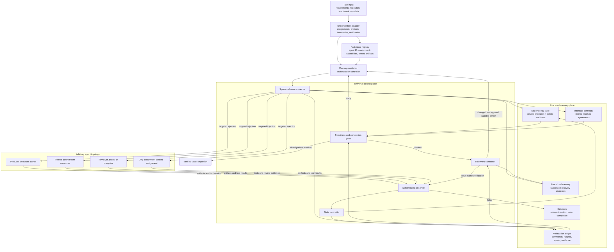
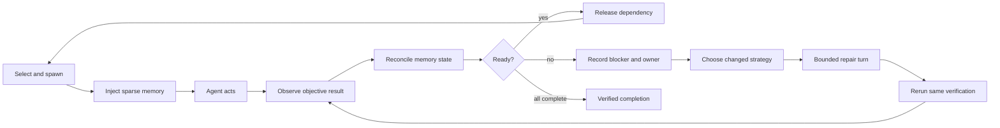

# Universal Multi-Agent Memory Plugin Architecture

## Goal

Port the strongest behavior of the original MultiAgentBench `all_three` system into a benchmark-independent OpenClaw plugin that supports fixed workflows, arbitrary feature owners, peer collaboration, and dynamic multi-agent topologies.

The target is not only memory retrieval. It is a memory-mediated control loop:

```text
memory + observation + targeted delivery + recovery scheduling + verification gates
```

## Target system graph



## Required runtime loop



## Universal relevance identity

Do not route primarily by fixed role names such as planner, implementer, or reviewer.

```text
relevance =
    project identity
  + assignment identity
  + owned or modified artifacts
  + producer/consumer participation
  + current stage
  + unresolved blocker
  + verification ownership
```

Canonical contract identity should be based on structured identity, not descriptive text:

```text
project + artifact + interface + memory kind + visibility owner
```

## Original reference implementation

- `dependency_memory/v4_sparse/run_feature_ablation.py`
- `dependency_memory/v4_sparse/sparse_memory.py`
- `dependency_memory/v4_sparse/coordination_memory.py`
- `dependency_memory/v4_sparse/interface_memory.py`
- `dependency_memory/v4_sparse/testing_practice_memory.py`
- `experiments/all_three_task1_20260803/`
- `experiments/all_three_remaining19_20260803/`
- `experiments/all_three_prework_v2_20tasks_20260803/`

Use `all_three` as the operational reliability reference and `all_three_prework_v2` as the contract-negotiation design reference.

## Architectural rule

```text
Universal memory identifies what matters.
Objective observation determines what is true.
Orchestration ensures an agent acts on it.
Verification determines when the system may proceed.
```

